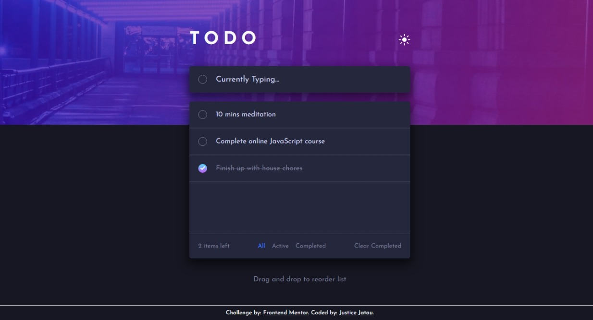

# Frontend Mentor - Todo app solution

This is a solution to the [Todo app challenge on Frontend Mentor](https://www.frontendmentor.io/challenges/todo-app-Su1_KokOW). Frontend Mentor challenges help you improve your coding skills by building realistic projects. 

## Table of contents

- [Overview](#overview)
  - [The challenge](#the-challenge)
  - [Screenshot](#screenshot)
  - [Links](#links)
- [My process](#my-process)
  - [Built with](#built-with)
  - [What I learned](#what-i-learned)
  - [Continued development](#continued-development)
  - [Useful resources](#useful-resources)
- [Author](#author)
- [Acknowledgments](#acknowledgments)

**Note: Delete this note and update the table of contents based on what sections you keep.**

## Overview

### The challenge

Users should be able to:

- View the optimal layout for the app depending on their device's screen size
- See hover states for all interactive elements on the page
- Add new todos to the list
- Mark todos as complete
- Delete todos from the list
- Filter by all/active/complete todos
- Clear all completed todos
- Toggle light and dark mode
- **Bonus**: Drag and drop to reorder items on the list

### Screenshot




### Links

- Solution URL: [here](https://github.com/JusticeJatau/Todo-Vanilla-Javascript)
- Live Site URL: [here](https://todo-app-vanilla-javascript.vercel.app/)

## My process

### Built with

- Semantic HTML5 markup
- CSS custom properties
- Flexbox

### What I learned

As a beginner exploring new stuffs, i've learned how to create a custom check box

```html
<input class="check" disabled type="checkbox" >
```
```css
input[type="checkbox"]{
    appearance:  none;

    width: 20px;
    height: 20px;
    border-radius: 50%;
    cursor: pointer;
    position: relative;
    border: 1px solid var(--Dark-Grayish-Blue-dark);
    display: flex;
    justify-content: center;
    align-items: center;
}
input[type="checkbox"]:checked{
    background: var(--Check-Background);
    border: none;
}
input[type="checkbox"]:checked::before{
    content: '';
    position: absolute;
    width: 10px;
    height: 10px;
    background: url("../images/icon-check.svg") no-repeat;
    transform: scale(1.1);
}
```

i've also understand how to implement drag and drop functionality now in javascript, for both mobile and desktop, by using eventlistener to listen for the the drag and drop event, and then calculate the right position to put element to re-order
 it
```html
<div draggable="true">
  <!-- content -->
<div/>
```
```js
// Desktop drag
draggable.addEventListener('dragstart', ()=>{
  //implement drag start
})

draggable.addEventListener('dragend', ()=>{
  //implement drag end
})

draggable.addEventListener('dragover', ()=>{
  //handles drag movement
})
//Mobile drag
draggable.addEventListener('tochstart', ()=>{
  //implement touch end
  //i also use interval because, the touchstart prevent scrolling on mobile
})
draggable.addEventListener('touchend', ()=>{
  //implement touch end
})
draggable.addEventListener('touchmove', ()=>{
  //handles touch movement
})

```

### Continued development

I'll like to improve more on the drag and drop functionality, because it have some problem when the scroll and try to reorder the list, i think i'll need a different approach to that. And i'll like to rebuild the project again, but this time with React.js

### Useful resources

- [ChatGPT](https://www.chat.openai.com) - This helped me for XYZ reason. I really liked this pattern and will use it going forward.
- [CodingNepal](https://www.youtube.com/watch?v=9HUlUnM3UG8&pp=ygU1ZHJhZyBhbmQgZHJvcCBzb3J0YWJsZSBsaXN0IGluIGh0bWwgY3NzICYgamF2YXNjcmlwdCA%3D) - This is an amazing article which helped me finally understand XYZ. I'd recommend it to anyone still learning this concept.

## Author

- Frontend Mentor - [@yourusername](https://www.frontendmentor.io/profile/JusticeJatau)
